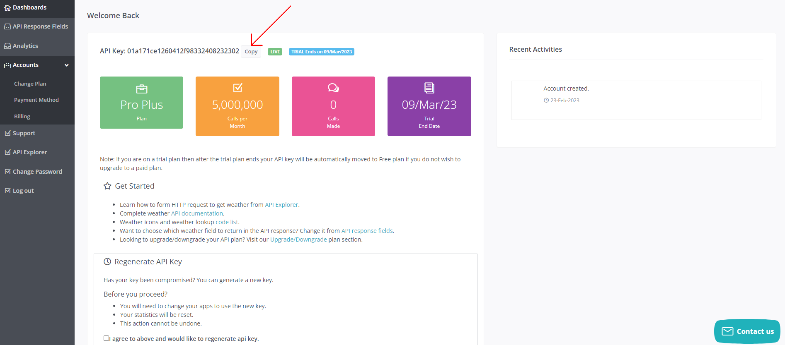

# Boas-vindas ao repositório do projeto iChoveu

Para realizar o projeto, atente-se a cada passo descrito a seguir e, se tiver qualquer dúvida, nos envie por _Slack_! #vqv 🚀

Aqui você vai encontrar os detalhes de como estruturar o desenvolvimento de seu projeto com base neste repositório utilizando uma branch específica e um _Pull Request_ para colocar seus códigos.

# Termos e acordos

Ao iniciar este projeto, você concorda com as diretrizes do Código de Conduta e do Manual da Pessoa Estudante da Trybe.

# Entregáveis

<details>
  <summary><strong>🤷🏽‍♀️ Como entregar</strong></summary><br />

  Para entregar seu projeto, você deverá criar um _Pull Request_ neste repositório.

  Lembre-se de que você pode consultar nosso conteúdo sobre [Git & GitHub](https://app.betrybe.com/learn/course/5e938f69-6e32-43b3-9685-c936530fd326/module/fc998c60-386e-46bc-83ca-4269beb17e17/section/fe827a71-3222-4b4d-a66f-ed98e09961af/day/1a530297-e176-4c79-8ed9-291ae2950540/lesson/2281eade-e2de-436e-a783-6b4108d188cc) e nosso [Blog - Git & GitHub](https://blog.betrybe.com/tecnologia/git-e-github/) sempre que precisar!
</details>

<details>
  <summary><strong>👨‍💻 O que deverá ser desenvolvido</strong></summary><br />

  Neste projeto, você desenvolverá um site de previsão do tempo!

  Para isso, vai consumir dados diretamente de uma API. 🤩

</details>

<details>
  <summary><strong>🗓 Data de entrega</strong></summary><br />
  
* Este projeto é individual.
* Serão `X` dias de projeto.
* Data para entrega final do projeto: `DD/MM/YYYY - 14:00h`.

</details>

# Orientações

<details>
  <summary><strong>‼️ Antes de começar a desenvolver</strong></summary><br />

  1. Clone o repositório

* Use o comando: `git clone git@github.com:tryber/sd-0x-project-iChoveu.git`.
* Entre na pasta do repositório que você acabou de clonar:
  * `cd sd-0x-project-iChoveu`

  2. Instale as dependências

* `npm install`.
  
  3. Crie uma branch a partir da branch `master`

* Verifique se você está na branch `master`
  * Exemplo: `git branch`
* Se não estiver, mude para a branch `master`
  * Exemplo: `git checkout master`
* Agora, crie uma branch à qual você vai submeter os `commits` de seu projeto
  * Você deve criar uma branch no seguinte formato: `nome-de-usuario-nome-do-projeto`
  * Exemplo: `git checkout -b joaozinho-sd-0x-project-iChoveu`

  4. Adicione as mudanças ao _stage_ do Git e faça um `commit`

* Verifique se as mudanças ainda não estão no _stage_
  * Exemplo: `git status` (deve aparecer listada a pasta _joaozinho_ em vermelho)
* Adicione o novo arquivo ao _stage_ do Git
  * Exemplo:
    * `git add .` (adicionando todas as mudanças - _que estavam em vermelho_ - ao stage do Git)
    * `git status` (deve aparecer listado o arquivo _joaozinho/README.md_ em verde)
* Faça o `commit` inicial
  * Exemplo:
    * `git commit -m 'iniciando o projeto x'` (fazendo o primeiro commit)
    * `git status` (deve aparecer uma mensagem tipo _nothing to commit_ )

  5. Adicione sua branch com o novo `commit` ao repositório remoto

* Usando o exemplo anterior: `git push -u origin joaozinho-sd-0x-project-iChoveu`

  6. Crie um `Pull Request` _(PR)_

* Vá até a página de _Pull Requests_ do [repositório no GitHub](https://github.com/tryber/sd-0x-project-iChoveu/pulls)
* Clique no botão verde _"New pull request"_
* Clique na caixa de seleção _"Compare"_ e escolha sua branch **com atenção**
* Dê um título à sua _Pull Request_
  * Exemplo: _"Cria tela de busca"_
* Clique no botão verde _"Create pull request"_
* Adicione uma descrição para o _Pull Request_ e clique no botão verde _"Create pull request"_
* **Não se preocupe em preencher mais nada por enquanto!**
* Volte até a [página de _Pull Requests_ do repositório](https://github.com/tryber/sd-0x-project-iChoveu/pulls) e confira se seu _Pull Request_ está criado

</details>

<details>
  <summary><strong>⌨️ Durante o desenvolvimento</strong></summary><br />

* Faça `commits` das alterações que você fizer no código regularmente

* Lembre-se de sempre atualizar o repositório remoto após um (ou alguns) `commits` 

* Os comandos que você utilizará com mais frequência são:
    1. `git status` _(para verificar o que está em vermelho - fora do stage - e o que está em verde - no stage)_
    2. `git add` _(para adicionar arquivos ao stage do Git)_
    3. `git commit` _(para criar um commit com os arquivos que estão no stage do Git)_
    4. `git push -u origin nome-da-branch` _(para enviar o commit para o repositório remoto na primeira vez em que fizer o `push` de uma nova branch)_
    5. `git push` _(para enviar o commit para o repositório remoto após o passo anterior)_

</details>

<details>
  <summary><strong>🤝 Depois de terminar o desenvolvimento (opcional)</strong></summary><br />

  Para sinalizar que seu projeto está pronto para o _"Code Review"_, faça o seguinte:

* Vá até a página **DE SEU** _Pull Request_, adicione a label de _"code-review"_ e marque seus colegas:

  * No menu à direita, clique no _link_ **"Labels"** e escolha a _label_ **code-review**.

  * No menu à direita, clique no _link_ **"Assignees"** e escolha **seu usuário**.

  * No menu à direita, clique no _link_ **"Reviewers"**, digite `students` e selecione o time `tryber/students-sd-000`.

  Caso tenha alguma dúvida, [aqui tem um video explicativo](https://vimeo.com/362189205).

</details>

<details>
  <summary><strong>🕵🏿 Revisando um pull request</strong></summary><br />

  Use o conteúdo sobre [Code Review](https://app.betrybe.com/learn/course/5e938f69-6e32-43b3-9685-c936530fd326/module/f04cdb21-382e-4588-8950-3b1a29afd2dd/section/b3af2f05-08e5-4b4a-9667-6f5f729c351d/lesson/36268865-fc46-40c7-92bf-cbded9af9006) para te ajudar a revisar os _Pull Requests_.

</details>

<details>
  <summary><strong>🎛 Linter</strong></summary><br />

  Para garantir a qualidade do código, vamos utilizar neste projeto o linter ESLint. Assim, o código estará alinhado com as boas práticas de desenvolvimento, sendo mais legível e de fácil manutenção! Para rodar o _linter_ localmente no projeto, execute o comando a seguir.

  `npm run lint`

  ⚠ PULL REQUESTS COM ISSUES DE LINTER NÃO SERÃO AVALIADAS. ATENTE-SE PARA RESOLVÊ-LAS ANTES DE FINALIZAR O DESENVOLVIMENTO! ⚠

  Em caso de dúvidas, confira o material do course sobre [ESLint e Stylelint](https://app.betrybe.com/learn/course/5e938f69-6e32-43b3-9685-c936530fd326/module/f04cdb21-382e-4588-8950-3b1a29afd2dd/section/3b1546b5-f7bc-40f7-a674-77b16c408756/lesson/0c9e8c0e-24c3-4526-ba6b-60d95913e022).
</details>

<a name="testes"></a>

<details>
  <summary><strong>🛠 Testes</strong></summary><br />

* <details><summary><b> Execução de testes de requisito</b></summary>

  Os testes deste projeto foram feitos por meio do [Cypress](https://www.cypress.io/how-it-works/). É utilizada nos testes a resolução `1366 x 768` (1366 pixels de largura por 768 pixels de altura) para testes de layout. Logo, recomenda-se desenvolver seu projeto usando a mesma resolução, via instalação [deste plugin](https://chrome.google.com/webstore/detail/window-resizer/kkelicaakdanhinjdeammmilcgefonfh?hl=en) do `Chrome` para facilitar a configuração dessa resolução, por exemplo.

  Para o projeto ser validado, todos os testes de comportamento devem passar. É possível testar isso local rodando `npm run cy`. Esse comando roda a suite de testes do Cypress que valida se o fluxo geral e os requisitos funcionais estão funcionando como deveriam. Você pode também executar o comando `npm run cy:open` para ter um resultado visual dos testes executados.

  Esses testes não consideram o layout de maneira geral, mas sim os atributos e as informações corretas, então preste atenção nisso! Os testes te darão uma mensagem de erro caso não estejam passando (seja qual for o motivo). 😉

  **Atenção**: Sua aplicação deve estar rodando para o Cypress no terminal poder testar.
  </details>

* <details><summary><b> Execução de um teste específico</b></summary>

  Para executar somente uma `spec` de testes, você pode rodar somente um arquivo de teste com o comando `npm run cy -- --spec cypress/integration/nomeDoArquivo_spec.js` ou pode selecionar qual delas você deseja após executar o comando `npm run cy:open`.

  Além disso, é possível rodar apenas um trecho de um `spec`. Para isso, basta utilizar a função .only após o `describe`, `it` ou `test`. Com isso, será possível que apenas parte de um teste rode localmente.

  </details>

* <details><summary><b> Execução de teste de cobertura</b></summary>

  Alguns requisitos pedirão a você que desenvolva testes para sua aplicação. Esses testes serão avaliados por meio da cobertura de testes.

  É possível verificar o percentual da cobertura de testes com o comando `npm run test-coverage`.

  Você também pode executar `npm run test-coverage -- --collectCoverageFrom=caminho/da/Pagina` para verificar o percentual de cobertura de testes de cada 'Pagina'. Por exemplo, para verificar a cobertura de testes da página de `Login`, execute o comando `npm run test-coverage -- --collectCoverageFrom=src/pages/Login.js`.
  </details><br />

</details>

<details>
  <summary><strong>🗣 Nos dê feedbacks sobre o projeto!</strong></summary><br />

Ao finalizar e submeter o projeto, não se esqueça de avaliar sua experiência preenchendo o formulário.
**Leva menos de 3 minutos!**

[FORMULÁRIO DE AVALIAÇÃO DE PROJETO](https://be-trybe.typeform.com/to/ZTeR4IbH)

</details>

<details>
  <summary><strong>💻 Protótipo do projeto no Figma</strong></summary><br />

  Além da qualidade do código e do atendimento aos requisitos, um bom layout é um dos aspectos responsáveis por melhorar a usabilidade de uma aplicação e turbinar seu portfólio!

  Você pode estar se perguntando: _"Como deixo meu projeto com um layout mais atrativo?"_ 🤔

  Nesse projeto, o layout já está pronto, no entanto, se quiser deixar seu projeto com sua cara, você poderá usar o Figma para criar um layout personalizado com base no protótipo que preparamos para você.

  - [protótipo do Figma](https://www.figma.com/file/1hP7zvxsVO3bguxES6Z5tj/%5BProject%5D%5BFrontend%5D-iChoveu?node-id=0%3A1&t=LssBwPTABbr9rIob-1)

</details>
<details>
  <summary><strong>🗂 Compartilhe seu portfólio!</strong></summary><br />

  Agora que você finalizou os requisitos, chegou a hora de mostrar ao mundo que você aprendeu algo novo! 🚀

  Siga esse [**guia que preparamos com carinho**](https://app.betrybe.com/learn/course/5e938f69-6e32-43b3-9685-c936530fd326/module/a3cac6d2-5060-445d-81f4-ea33451d8ea4/section/d4f5e97a-ca66-4e28-945d-9dd5c4282085/day/eff12025-1627-42c6-953d-238e9222c8ff/lesson/49cb103b-9e08-4ad5-af17-d423a624285a) para disponibilizar o projeto finalizado em seu GitHub pessoal.

  Esse passo é super importante para ganhar mais visibilidade no mercado de trabalho, mas também é útil para manter um back-up de seu trabalho.

  Você sabia que o LinkedIn é a principal rede social profissional e compartilhar o aprendizado nela é muito importante para quem deseja construir uma carreira de sucesso? Compartilhe esse projeto em seu LinkedIn, marque o perfil da Trybe (@trybe) e mostre para sua rede toda sua evolução.

  </details>

# Acessando a API

<details>
<summary>Como acessar a API</summary><br />

Para isso, será necessário que você crie uma conta no [WeatherAPI](https://www.weatherapi.com/signup.aspx) e gere uma chave de API.

Após acessar sua conta, você verá uma tela como a seguinte:



Nessa página, você deve clicar no botão `Copy` para copiar a chave (ou token) da API. É com ela que você vai se autenticar na API, então guarde-a em um lugar seguro.

Crie um arquivo `.env` na raiz do projeto e adicione a chave de API que você acabou de copiar, como no exemplo a seguir.

```sh
VITE_TOKEN=SEU_TOKEN_AQUI
```

O arquivo `.env` já está configurado no arquivo `.gitignore` para que não seja enviado para o repositório remoto, então seu token será mantido apenas localmente.

Daqui pra frente, você pode acessar o token por meio do objeto `import.meta.env.VITE_TOKEN` dentro de seu código.

Caso queira explorar a API, você poderá acessar a [documentação](https://www.weatherapi.com/docs/) e ver como ela funciona ou acessar o [playground](https://www.weatherapi.com/api-explorer.aspx) para testar as requisições.

</details>

# Requisitos

> Este projeto tem algumas funções já prontas e, à medida que você for implementando os requisitos, que tal dar uma olhada e entender como elas funcionam? Pode ser um bom modo de entender como o código está organizado e como você pode implementar os requisitos, além de servir como um exercício de leitura de código. 😉

> ⚠️ Com exceção de algumas especificações, você tem total liberdade para implementar o código da maneira que achar melhor e até mesmo modificar o código já existente, desde que respeite as informações que devem ser exibidas na tela e a seção `O que será verificado` de cada requisito.

> ⚠️ Importante que você tenha lido e realizado os passos da seção [Acessando a API](#acessando-a-api) antes de começar a implementar os requisitos.

## 1. Implemente a função `searchCities`

<details><summary>Implemente a função <code>searchCities</code> que se encontra no arquivo <code>helpers/weatherAPI.js</code></summary><br />

A função `searchCities` já está criada e é utilizada ao clicar no botão de pesquisar. Porém, ela não está funcionando, pois ainda não foi implementada. Você deve implementar a função para que ela retorne uma lista de cidades que correspondam ao termo de busca.

A função recebe um parâmetro `term`, que será o termo de busca. Por exemplo, se o usuário digitar "São Paulo" no campo de busca, o parâmetro `term` será "São Paulo".

Você deverá utilizar o endpoint de pesquisa de cidades para obter os dados das cidades que correspondam ao termo de busca.

<details><summary>Endpoint de pesquisa de cidades</summary><br />

  URL: `http://api.weatherapi.com/v1/search.json?lang=pt&key=${TOKEN}&q=${TERMO_DE_BUSCA}`

  Em que:
  - `TERMO_DE_BUSCA` é o termo que você deseja pesquisar, por exemplo: `São Paulo`, `Rio de Janeiro` e `São José dos Campos`.
  - `TOKEN` é o token que está salvo no arquivo `.env`.

  **Exemplo de requisição pesquisando por "Rio"**:
  
  URL: `http://api.weatherapi.com/v1/search.json?lang=pt&key=06a38ce1c71451241579789&q=Rio`

  ```json
  [
    {
        "id": 287907,
        "name": "Rio De Janeiro",
        "region": "Rio de Janeiro",
        "country": "Brazil",
        "lat": -22.9,
        "lon": -43.23,
        "url": "rio-de-janeiro-rio-de-janeiro-brazil"
    },
    {
        "id": 287839,
        "name": "Rio Branco",
        "region": "Acre",
        "country": "Brazil",
        "lat": -9.97,
        "lon": -67.8,
        "url": "rio-branco-acre-brazil"
    },
    {
        "id": 110688,
        "name": "Rio Cuarto",
        "region": "Cordoba",
        "country": "Argentina",
        "lat": -33.13,
        "lon": -64.35,
        "url": "rio-cuarto-cordoba-argentina"
    },
    {
        "id": 669733,
        "name": "Riobamba",
        "region": "Chimborazo",
        "country": "Ecuador",
        "lat": -1.67,
        "lon": -78.63,
        "url": "riobamba-chimborazo-ecuador"
    },
    {
        "id": 3176833,
        "name": "Rio Bravo",
        "region": "Tamaulipas",
        "country": "Mexico",
        "lat": 25.99,
        "lon": -98.09,
        "url": "rio-bravo-tamaulipas-mexico"
    }
  ]
  ```

</details>

Após realizar a requisição, você deve retornar uma lista de objetos. Caso a lista esteja vazia, você deverá exibir um alert com a mensagem "Nenhuma cidade encontrada" e retornar a lista vazia.
> 💡 Atenção: Utilize window.alert

</details>
<details><summary><strong>O que será verificado</strong></summary><br />

- Será validado se a função `searchCities`:
  - Chama o endpoint de pesquisa de cidades com o termo de busca.
  - Exibe um alert com a mensagem "Nenhuma cidade encontrada" caso a lista esteja vazia.

</details>

---

## 2. Implemente a função `getWeatherByCity`

<details><summary>Implemente a função <code>getWeatherByCity</code> que se encontra no arquivo <code>helpers/weatherAPI.js</code></summary><br />

A função `getWeatherByCity` recebe um parâmetro `cityURL` que será o URL da cidade obtido na requisição de pesquisa de cidades. Por exemplo, se o usuário pesquisar por "São Paulo", o parâmetro `cityURL` será "sao-paulo-sao-paulo-brazil".

<details><summary>Endpoint do tempo atual</summary><br />

  URL: `http://api.weatherapi.com/v1/current.json?lang=pt&key=${TOKEN}&q=${URL_CIDADE}`

  Em que:
  - `URL_CIDADE` é o URL da cidade obtido na requisição anterior.
  - `TOKEN` é o token que está salvo no arquivo `.env`.

  **Exemplo de requisição pesquisando por "sao-paulo-sao-paulo-brazil"**:
  
  URL: `http://api.weatherapi.com/v1/current.json?lang=pt&key=06a38ce1c71451241579789&q=sao-paulo-sao-paulo-brazil`

  ```json
    {
      "location": {
          "name": "Sao Paulo",
          "region": "Sao Paulo",
          "country": "Brazil",
          "lat": -23.53,
          "lon": -46.62,
          "tz_id": "America/Sao_Paulo",
          "localtime_epoch": 1677457628,
          "localtime": "2023-02-23 21:27"
      },
      "current": {
          "last_updated_epoch": 1677456900,
          "last_updated": "2023-02-23 21:15",
          "temp_c": 25.0,
          "temp_f": 77.0,
          "is_day": 0,
          "condition": {
              "text": "Clear",
              "icon": "//cdn.weatherapi.com/weather/64x64/night/113.png",
              "code": 1000
          },
          "wind_mph": 2.2,
          "wind_kph": 3.6,
          "wind_degree": 189,
          "wind_dir": "S",
          "pressure_mb": 1018.0,
          "pressure_in": 30.06,
          "precip_mm": 0.6,
          "precip_in": 0.02,
          "humidity": 65,
          "cloud": 0,
          "feelslike_c": 27.5,
          "feelslike_f": 81.5,
          "vis_km": 10.0,
          "vis_miles": 6.0,
          "uv": 1.0,
          "gust_mph": 8.5,
          "gust_kph": 13.7
      }
    }
  ```

</details>

Após realizar a requisição, a função deve retornar um objeto apenas com as informações do tempo atual da cidade. Seguindo o exemplo de requisição acima, o retorno da função deve ser:

```json
{
  "temp": 25.0, // temperatura em graus celsius
  "condition": "Clear",
  "icon": "//cdn.weatherapi.com/weather/64x64/night/113.png"
}
```
> O retorno da função não precisa ser igual, portanto fique à vontade para mudar o retorno da forma que quiser. Esse é apenas um exemplo para que você possa entender quais informações são importantes.

</details>

<details><summary>Complemente a função <code>handleSearch</code> que se encontra no arquivo <code>helpers/pageFunctions.js</code></summary><br />

Dentro da função `handleSearch` no arquivo `helpers/pageFunctions.js`, a função `searchCities` já é chamada, porém seu retorno não é utilizado. Você deve utilizar o retorno da função `searchCities` para requisitar o tempo atual.
> A função `handleSearch` pode ser alterada da maneira que você quiser.

Para cada cidade retornada pela `searchCities`, você deve chamar a função `getWeatherByCity` passando o URL da cidade como parâmetro.
> Dica: Uma das formas de se aguardar por múltiplas requisições é utilizando o método [`Promise.all`](https://developer.mozilla.org/pt-BR/docs/Web/JavaScript/Reference/Global_Objects/Promise/all)

</details>

<details><summary><strong>O que será verificado</strong></summary><br />

- Será validado se a função `getWeatherByCity`:
  - Chama o endpoint do tempo atual com o URL de todas cidades encontradas.

</details>

---

## 3. Liste as cidades retornadas pela API

<details>
<summary>Após a chamada da API, renderize o retorno utilizando a função <code>createCityElement</code></summary><br />

  Com o resultado do tempo atual de todas cidades, adquirido no requisito 2, utilize a função `createCityElement` para criar os elementos HTML que representam as cidades retornadas pela API.

  > A função `createCityElement` já está implementada no arquivo `helpers/pageFunctions.js`.
  > Fique a vontade para alterar o código dessa função, caso necessário.

  Ela recebe como parâmetro um objeto que contém as seguintes informações:
  ```js
    {
      name: 'Rio de Janeiro',
      country: 'Brazil',
      temp: 25.0, // temperatura em graus celsius
      condition: 'Clear',
      icon: '//cdn.weatherapi.com/weather/64x64/night/113.png',
      url: 'rio-de-janeiro-rio-de-janeiro-brazil'
    }
  ```
  > Esse é o formato do objeto que a função `createCityElement` recebe. Caso queira alterar o formato do objeto, fique à vontade para alterar a função `createCityElement`.

  - Adicione cada elemento criado pela função `createCityElement` como filho do elemento `<ul id="cities">`.

</details>

<details>
<summary><strong>O que será verificado</strong></summary><br />

- Será validado se, ao pesquisar por uma cidade, o elemento `<ul id="cities">` será preenchido com os elementos HTML das cidades retornadas pela API com as informações do tempo atual.

</details>

---

## 4. Adicione um botão para ver a previsão de 7 dias de uma cidade

<details><summary>Crie um botão dentro do elemento de cada cidade</summary><br />

  Modifique a função `createCityElement`, de modo que ela crie um botão para cada cidade retornada pela API.

  Esse botão deve conter o texto "Ver previsão".

  Adicione ao botão o evento de click que, ao ser clicado, deve realizar a requisição da previsão de 7 dias da cidade.

  <details><summary>Endpoint da previsão do tempo</summary><br />

  URL: `http://api.weatherapi.com/v1/forecast.json?lang=pt&key=${TOKEN}&q=${URL_CIDADE}&days=${DIAS}`

  Em que:
  - `URL_CIDADE` é o URL da cidade.
  - `TOKEN` é o token que está salvo no arquivo `.env`.
  - `DIAS` é a quantidade de dias que você deseja obter a previsão. Nesse caso, sempre será 7 dias.

  **Exemplo de requisição pesquisando por "sao-paulo-sao-paulo-brazil":**

  URL: `http://api.weatherapi.com/v1/forecast.json?lang=pt&key=06a38ce1c71451241579789&q=sao-paulo-sao-paulo-brazil&days=7`

  Utilize apenas as informações contidas no array forecastday:
  ```json
  {
    "location": {/*...*/},
    "current": {/*...*/},
    "forecast": {
      "forecastday": [
        {
          "date": "2023-02-23",
          "date_epoch": 1677369600,
          "day": {
            "maxtemp_c": 30.6,
            "maxtemp_f": 87.1,
            "mintemp_c": 20.3,
            "mintemp_f": 68.5,
            "avgtemp_c": 25,
            "avgtemp_f": 76.9,
            "maxwind_mph": 8.9,
            "maxwind_kph": 14.4,
            "totalprecip_mm": 1.8,
            "totalprecip_in": 0.07,
            "totalsnow_cm": 0,
            "avgvis_km": 9.8,
            "avgvis_miles": 6,
            "avghumidity": 76,
            "daily_will_it_rain": 1,
            "daily_chance_of_rain": 87,
            "daily_will_it_snow": 0,
            "daily_chance_of_snow": 0,
            "condition": {
              "text": "Patchy rain possible",
              "icon": "//cdn.weatherapi.com/weather/64x64/day/176.png",
              "code": 1063
            },
            "uv": 5
          },
          "astro": {/*...*/},
          "hour": [/*...*/]
        },
        {/*Informações do segundo dia*/},
        {/*Informações do terceiro dia*/},
        /* etc */
      ]
    }
  }
  ```

</details>

  Utilize a função `showForecast` para exibir a previsão do tempo da cidade, que será mostrada na tela dentro de um modal.
  > A função `showForecast` já está implementada no arquivo `helpers/pageFunctions.js`

  Ela recebe como parâmetro um array com a previsão do tempo dos próximos dias, contendo as seguintes informações:

  ```js
    [
      {
        date: '2023-02-23',
        maxTemp: 30.6, // temperatura em graus celsius
        minTemp: 20.3, // temperatura em graus celsius
        condition: 'Patchy rain possible',
        icon: '//cdn.weatherapi.com/weather/64x64/day/176.png'
      },
      {/*Informações do segundo dia*/},
      {/*Informações do terceiro dia*/},
      /* etc */
    ]
  ```

</details>

<details>
<summary><strong>O que será verificado</strong></summary><br />

- Será validado se o botão tem o texto "Ver previsão".
- Será validado se todas as cidades retornadas pela API têm um botão "Ver previsão".
- Será validado se, ao clicar no botão "Ver previsão" de uma cidade, serão exibidas as informações da previsão do tempo da cidade.

</details>
